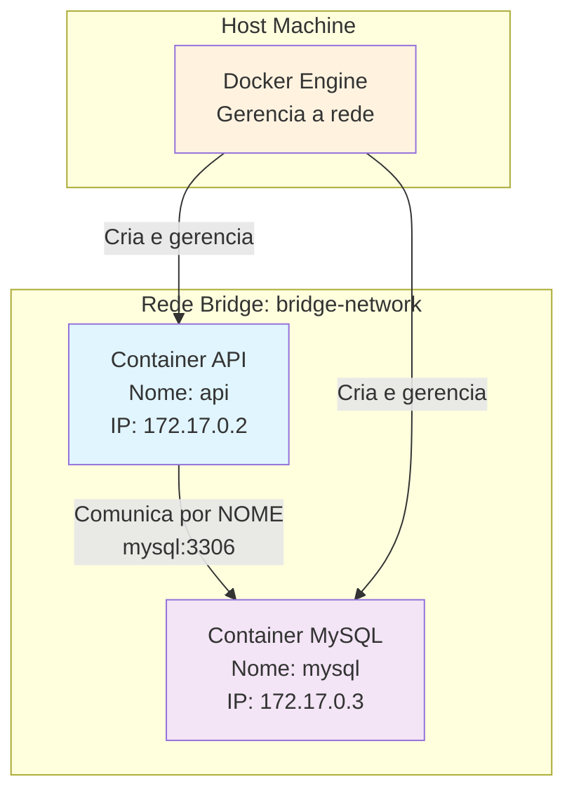

# 🌐 Rede Bridge no Docker

> **Objetivo:** Demonstrar como containers Docker se comunicam através de redes bridge, usando uma API Java e MySQL como exemplo prático.

## 📋 Índice

- [O que é Rede Bridge?](#-o-que-é-rede-bridge)
- [Como Funciona a Comunicação](#-como-funciona-a-comunicação)
- [Exemplo Prático](#-exemplo-prático)
- [Configuração e Teste](#-configuração-e-teste)
- [Troubleshooting](#-troubleshooting)

## 🎯 O que é Rede Bridge?

A **rede bridge** é o tipo de rede padrão do Docker que permite comunicação entre containers no mesmo host. É como criar uma "ponte" virtual onde containers podem se "encontrar" e conversar.

### Características da Rede Bridge:

- ✅ **Comunicação automática** entre containers
- ✅ **Resolução de nomes DNS** integrada
- ✅ **Isolamento** da rede do host
- ✅ **Configuração simples** e transparente

## 🔗 Como Funciona a Comunicação

### Analogia: A Ponte Virtual

Imagine que você tem duas casas (containers) em uma ilha (host). A **rede bridge** é como construir uma ponte entre essas casas, permitindo que os moradores se visitem usando apenas o **nome da casa**, não o endereço completo.



### 🔍 Resolução de Nomes

Na rede bridge, containers se comunicam usando **nomes**, não IPs:

```bash
# ❌ Sem rede bridge (não funciona)
jdbc:mysql://172.17.0.3:3306/database

# ✅ Com rede bridge (funciona!)
jdbc:mysql://mysql:3306/database
```

**Por que isso é importante?**
- 🎯 **Simplicidade:** Não precisa descobrir IPs
- 🔄 **Flexibilidade:** IPs podem mudar, nomes não
- 🛡️ **Isolamento:** Containers não veem a rede do host

## 🛠️ Exemplo Prático

Vamos ver como implementar uma rede bridge com uma API Java e MySQL:

### 1. Criando a Rede Bridge

```bash
# Criar uma rede bridge personalizada
docker network create bridge-network

# Verificar a rede criada
docker network ls
```

### 2. Configuração da Aplicação

A API Java se conecta ao MySQL usando o **nome do container**:

```properties
# application.properties
spring.datasource.url=jdbc:mysql://mysql:3306/algatransito
spring.datasource.username=alga
spring.datasource.password=123456
```

**Ponto-chave:** Note que usamos `mysql:3306`, não um IP específico!

### 3. Docker Compose com Rede Bridge

```yaml
version: '3.8'

services:
  mysql:
    image: mysql:8.0
    container_name: mysql
    environment:
      MYSQL_ROOT_PASSWORD: root123
      MYSQL_DATABASE: algatransito
      MYSQL_USER: alga
      MYSQL_PASSWORD: 123456
    networks:
      - bridge-network

  api:
    image: algatransito-api:latest
    container_name: api
    environment:
      DB_HOST: mysql  # ← Nome do container MySQL
    networks:
      - bridge-network

networks:
  bridge-network:
    driver: bridge  # ← Tipo de rede
```

## ⚙️ Configuração e Teste

### 1. Executar os Containers

```bash
# Iniciar os serviços
docker-compose up -d

# Verificar se estão na mesma rede
docker network inspect bridge-network
```

### 2. Testar a Comunicação

```bash
# Verificar se a API consegue resolver o nome "mysql"
docker exec -it api nslookup mysql

# Testar conectividade
docker exec -it api ping mysql

# Verificar logs da API
docker logs api
```

### 3. Verificar a Rede

```bash
# Listar redes
docker network ls

# Inspecionar a rede bridge
docker network inspect bridge-network

# Ver containers conectados
docker network inspect bridge-network | grep -A 10 "Containers"
```

## 🎯 Pontos-Chave da Rede Bridge

### 1. Resolução de Nomes

```bash
# Dentro da rede bridge, containers se encontram por nome
mysql:3306    # ✅ Funciona
172.17.0.3:3306  # ❌ IP pode mudar
```

### 2. Isolamento de Rede

```bash
# Containers na rede bridge NÃO veem:
# - Rede do host
# - Containers de outras redes
# - Internet (a menos que configurado)
```

### 3. Comunicação Bidirecional

```bash
# API pode acessar MySQL
api → mysql:3306

# MySQL pode acessar API (se necessário)
mysql → api:8080
```

## 🚨 Troubleshooting

### Problema: API não consegue conectar ao MySQL

**Sintomas:**
```bash
Connection refused: mysql:3306
```

**Soluções:**
1. **Verificar se containers estão na mesma rede:**
   ```bash
   docker network ls
   docker network inspect bridge-network
   ```

2. **Verificar resolução de nomes:**
   ```bash
   docker exec -it api nslookup mysql
   ```

3. **Verificar se MySQL está rodando:**
   ```bash
   docker ps | grep mysql
   docker logs mysql
   ```

### Problema: Nome não resolve

**Sintomas:**
```bash
nslookup: can't resolve 'mysql'
```

**Soluções:**
1. **Verificar se containers estão na mesma rede:**
   ```bash
   docker network inspect bridge-network
   ```

2. **Reconectar containers à rede:**
   ```bash
   docker network disconnect bridge-network api
   docker network connect bridge-network api
   ```

### Problema: Containers não se comunicam

**Sintomas:**
```bash
ping: mysql: Name or service not known
```

**Soluções:**
1. **Verificar configuração do docker-compose:**
   ```yaml
   networks:
     - bridge-network  # ← Deve estar presente em ambos os serviços
   ```

2. **Reiniciar os containers:**
   ```bash
   docker-compose down
   docker-compose up -d
   ```

## 🎓 Resumo: Rede Bridge

### ✅ O que aprendemos:

1. **Rede Bridge** permite comunicação entre containers por nome
2. **Resolução DNS** automática dentro da rede
3. **Isolamento** da rede do host
4. **Configuração simples** via docker-compose

### 🔑 Conceitos-chave:

- Containers se comunicam por **nome**, não IP
- Rede bridge é **isolada** do host
- **DNS interno** resolve nomes automaticamente
- Comunicação é **bidirecional**

---

> **💡 Dica do Mentor:** A rede bridge é a base da comunicação entre containers. Domine este conceito, pois ele é fundamental para orquestradores como Kubernetes, onde pods se comunicam de forma similar através de services.

**Reflexão Guiada:** Agora que você entende como funciona a rede bridge, que tal pensar em cenários onde você precisaria de múltiplas redes? Por exemplo, separar containers de banco de dados dos containers de aplicação por questões de segurança?
